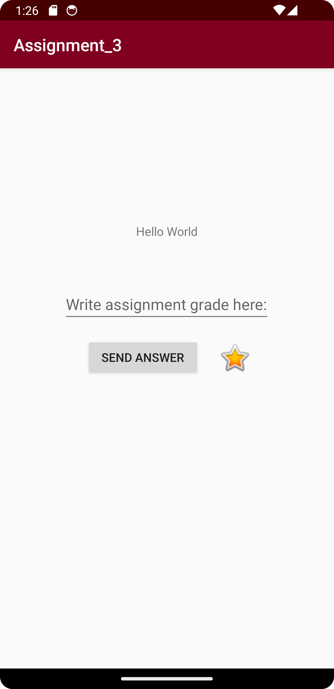

# Rapport

Jag började med att ändra appnamn till "Assignment_3". Sedan ändrade jag <TextView> så att det inte var en hårdkodad text och skapade en string inuti "strings.xml" istället.
Sedan lade jag till <EditText/>, <Button/> och en <ImageView/>. För detta användes constraintlayout med width och height satta till "wrap_content". För ImageView använde jag en .png
som redan fanns inuti Android Studio, i detta fall en stjärna. Efter detta ändrade jag elementens position via designvyn samt lade till en margin på ImageView. Exempel på specifikt imageView-koden finns nedan:
Det sista jag ändrade var appens färger i "colors.xml". Primärfärgen ändrades till Vinröd och "ColorPrimaryDark" fick en något mörkare vinröd.
```
<ImageView
        android:id="@+id/imageView5"
        android:layout_width="40dp"
        android:layout_height="47dp"
        app:layout_constraintBottom_toBottomOf="@+id/button"
        app:layout_constraintEnd_toEndOf="parent"
        app:layout_constraintHorizontal_bias="0.093"
        app:layout_constraintStart_toEndOf="@+id/button"
        app:layout_constraintTop_toTopOf="@+id/button"
        app:layout_constraintVertical_bias="0.0"
        app:srcCompat="@android:drawable/btn_star_big_on"
        android:layout_marginStart="10dp"/>
```

## Bilder
 